<div align="center">

<br>


<br><br>

<picture>
  <source media="(prefers-color-scheme: dark)" srcset="docs/assets/banner.svg">
  <source media="(prefers-color-scheme: light)" srcset="docs/assets/banner.svg">
  
</picture>

<br><br>

### Type `/visualise`. See it.

A [Claude Code](https://docs.anthropic.com/en/docs/claude-code) skill that turns any concept into an interactive HTML visualization, or a live playground you can tune.

<br>

[](LICENSE)
[](https://docs.anthropic.com/en/docs/claude-code)
[](https://qlawd.github.io/visualise)
[]()
[](CONTRIBUTING.md)

<br>

[**Live Gallery**](https://qlawd.github.io/visualise) ·
[Install](#install) ·
[How It Works](#how-it-works) ·
[Contributing](CONTRIBUTING.md)

<br>

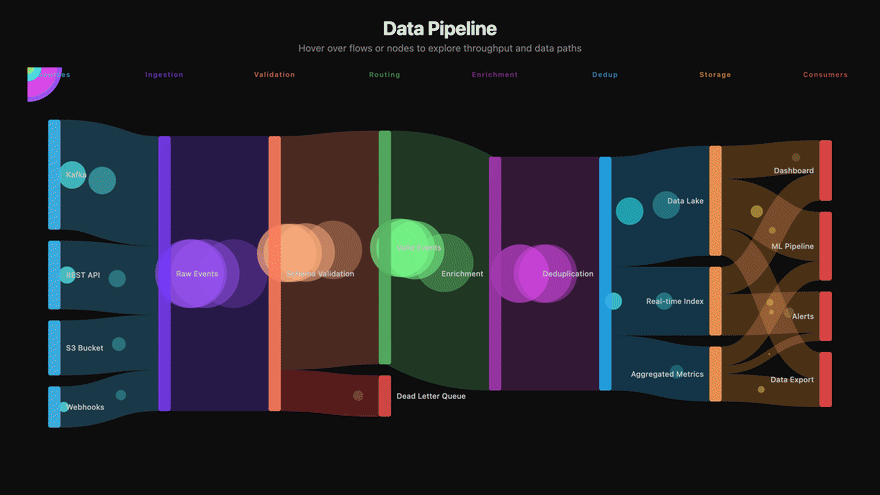

<sub><em>Generated by <code>/visualise data pipeline</code>. One of the examples in the <a href="https://qlawd.github.io/visualise">live gallery</a>.</em></sub>

<br>

</div>

> Force graphs, state diagrams, Sankeys, treemaps, equity curves, heatmaps, radial trees, parallel coordinates, and interactive playgrounds. Whatever fits the concept. It runs as a single HTML file with no runtime, no dependencies, and no config.

<br>

## See what it builds

Every visualization below was generated by this skill. **[Open the live gallery](https://qlawd.github.io/visualise)** to interact with each one.

<table>
<tr>
<td align="center" width="25%">
<a href="https://qlawd.github.io/visualise/force-graph-microservices.html">
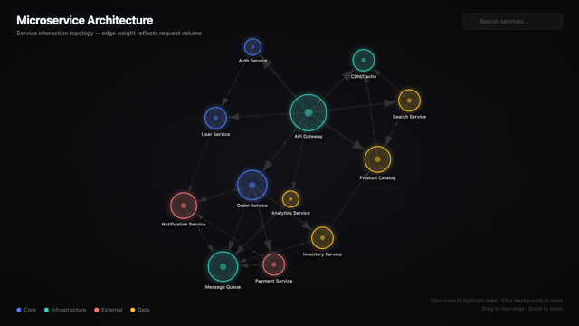<br>
<strong>Microservice Architecture</strong></a><br>
<sub>Force graph, drag to rearrange, click to trace dependencies</sub>
</td>
<td align="center" width="25%">
<a href="https://qlawd.github.io/visualise/sankey-data-pipeline.html">
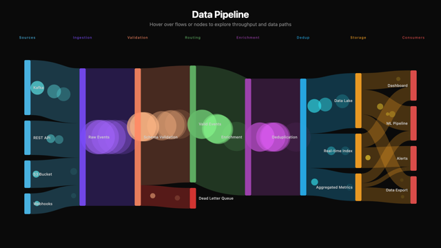<br>
<strong>Data Pipeline</strong></a><br>
<sub>Sankey, animated particles, hover to trace paths</sub>
</td>
<td align="center" width="25%">
<a href="https://qlawd.github.io/visualise/state-diagram-git-flow.html">
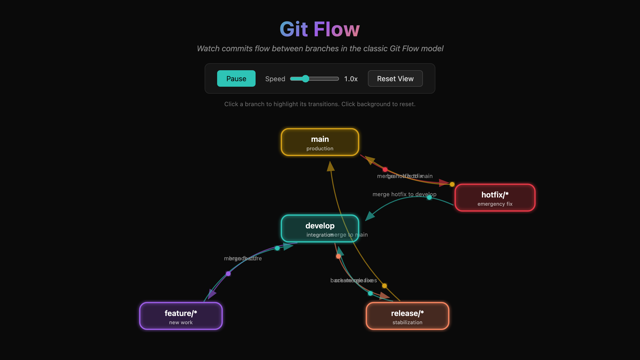<br>
<strong>Git Flow</strong></a><br>
<sub>State diagram, animated commit tokens, play and pause</sub>
</td>
<td align="center" width="25%">
<a href="https://qlawd.github.io/visualise/treemap-bundle-size.html">
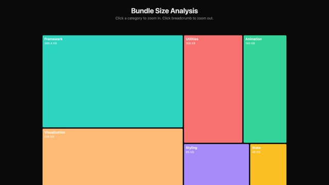<br>
<strong>Bundle Size Analysis</strong></a><br>
<sub>Treemap, click to zoom, breadcrumb navigation</sub>
</td>
</tr>
<tr>
<td align="center" width="25%">
<a href="https://qlawd.github.io/visualise/equity-curve-backtest.html">
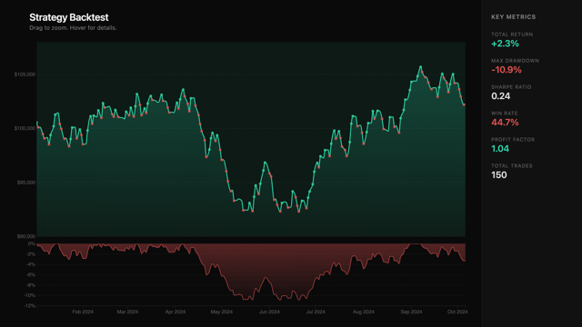<br>
<strong>Strategy Backtest</strong></a><br>
<sub>Equity curve, drawdown chart, drag to zoom</sub>
</td>
<td align="center" width="25%">
<a href="https://qlawd.github.io/visualise/heatmap-correlation-matrix.html">
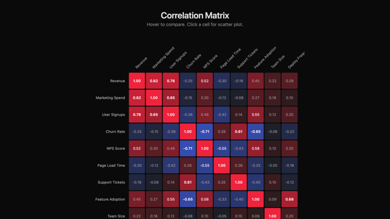<br>
<strong>Correlation Matrix</strong></a><br>
<sub>Heatmap, hover highlights row and column, click for scatter</sub>
</td>
<td align="center" width="25%">
<a href="https://qlawd.github.io/visualise/radial-tree-file-system.html">
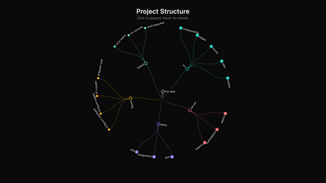<br>
<strong>Project Structure</strong></a><br>
<sub>Radial tree, click to expand and collapse, color coded</sub>
</td>
<td align="center" width="25%">
<a href="https://qlawd.github.io/visualise/parallel-coordinates-tradeoffs.html">
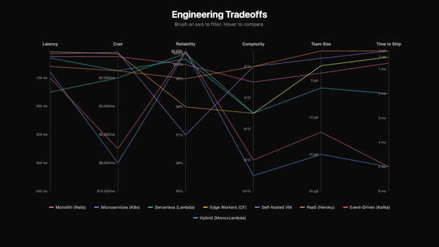<br>
<strong>Engineering Tradeoffs</strong></a><br>
<sub>Parallel coordinates, brush to filter, click to pin</sub>
</td>
</tr>
</table>

Playground mode builds a live model with controls you can operate:

<table>
<tr>
<td align="center" width="50%">
<a href="https://qlawd.github.io/visualise/unit-economics-playground.html">
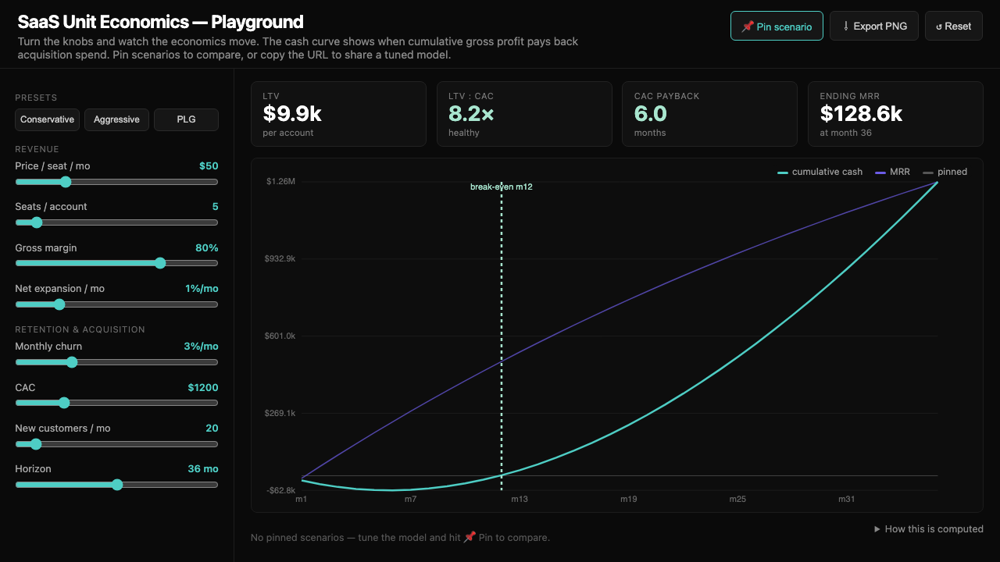<br>
<strong>SaaS Unit Economics</strong></a><br>
<sub>Sliders and a live model, presets, pin and compare scenarios, shareable URL</sub>
</td>
<td align="center" width="50%">
<a href="https://qlawd.github.io/visualise/rate-limiter-token-bucket.html">
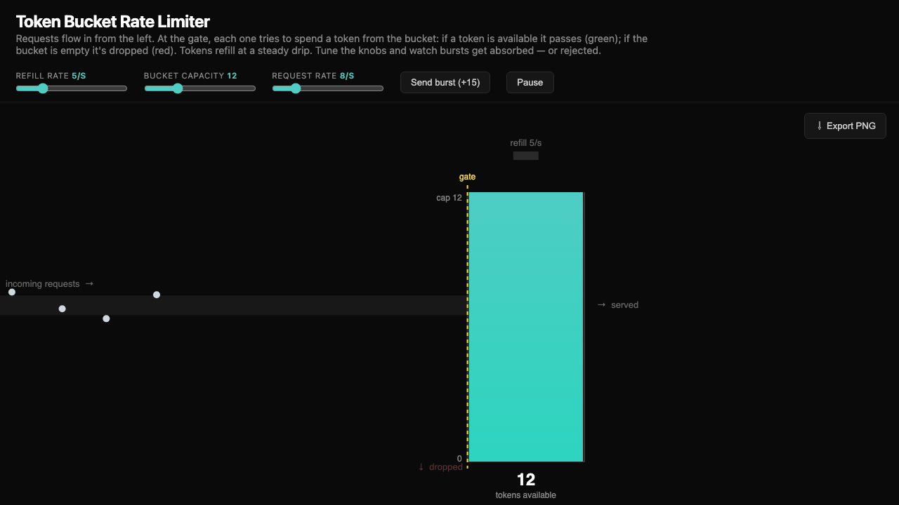<br>
<strong>Token Bucket Rate Limiter</strong></a><br>
<sub>Refill, capacity, and rate knobs, plus a burst button</sub>
</td>
</tr>
</table>

<br>

## Install

```bash
git clone https://github.com/qlawd/visualise ~/.claude/skills/visualise
```

Then open Claude Code and run:

```
/visualise microservice architecture of this repo
```

<br>

## Usage

```
/visualise the auth flow as an animated state machine
/visualise correlation between these columns
/visualise git branching strategy
/visualise bundle sizes in package.json
/visualise our pricing model as a playground
```

Claude reads your codebase context, picks the best visualization type, generates a self-contained interactive HTML file, and opens it in your browser. From there you iterate in plain English:

```
> make the nodes bigger
> add a legend
> color by module instead of type
> add zoom and pan
```

<br>

## How It Works

```
 /visualise <topic>
       |
       v
 +---------------------+
 |  Read context       |  Files, data, architecture,
 |  from your project  |  concepts, knowledge base
 +----------+----------+
            |
            v
 +---------------------+
 |  Pick the mode      |  Explain (show a thing) or
 |                     |  Playground (let you tune a thing)
 +----------+----------+
            |
            v
 +---------------------+
 |  Pick the view      |  Force graph, Sankey, treemap,
 |                     |  heatmap, or controls plus a model
 +----------+----------+
            |
            v
 +---------------------+
 |  Generate HTML      |  Single file, dark theme,
 |                     |  D3 / Canvas / SVG, with PNG export
 +----------+----------+
            |
            v
 +---------------------+
 |  Look at it and     |  Headless screenshot, read it back,
 |  self-correct       |  score against a rubric, fix, repeat
 +----------+----------+   (up to 3 passes, before you see it)
            |
            v
 +---------------------+
 |  Open in browser    |  Iterate from here
 +---------------------+
```

> **It checks its own work.** The model writes correct-looking code, but it cannot tell what that code renders as. Before handing off, visualise screenshots the page with a headless browser, reads the image back, and checks it for dead space, overlapping labels, clipping, and blank renders, then fixes what it finds. If no headless browser is installed, it skips this pass and opens the file directly.

### Two modes

| Mode | What it makes | When to use it |
|:---|:---|:---|
| **Explain** (default) | A visualization you read and explore | Concepts, codebases, data, architecture, designs |
| **Playground** | A live sandbox you operate, with inputs that drive the outputs | Models and systems such as pricing, rate limiters, retry and backoff, caches, and queues, or any time you ask to simulate, tune, or play with something |

Every playground has a controls panel and a single pure model, headline output readouts, named presets, pinned scenarios you can compare, and shareable state encoded in the URL. See the [Unit Economics](https://qlawd.github.io/visualise/unit-economics-playground.html) example.

The skill maps a topic to the right view automatically:

| What you are visualizing | What you get |
|:---|:---|
| Dependencies, relationships | Force-directed graph |
| Data flows, pipelines | Sankey diagram |
| State machines, processes | Animated state diagram |
| Hierarchies, file trees | Treemap or radial tree |
| Time series, performance | Interactive line chart with zoom |
| Tradeoffs, comparisons | Parallel coordinates |
| Correlations, matrices | Heatmap with hover details |
| Distributions, statistics | Histogram and box plot |
| Architecture, system design | Box and arrow with zoom and pan |
| Models with parameters | Controls plus a live model |

<br>

## Design Principles

| Principle | Why |
|:---|:---|
| **Single file** | Everything inline. No build step. Share by sending one `.html` file. |
| **Dark theme** | Developers work in dark mode, so the visualizations match. |
| **Interactive first** | Every output has hover, click, drag, or animation. |
| **Real data** | When connected to a codebase, it uses actual names, dependencies, and metrics. |
| **Sees its own output** | It renders, screenshots, and checks itself before you look. |
| **Always exportable** | Every visualization has a built-in 2x Export PNG button. |
| **Conversational** | Iterate in plain English, such as "make the nodes bigger" or "add a legend". |

<br>

## Customizing

Fork the repo and edit `SKILL.md` to change the defaults:

| What | Where in SKILL.md |
|:---|:---|
| Color palette | The `Design Language` section, swap the seven accent colors |
| Light theme | Change `#0a0a0a` and `#e0e0e0` to your preferred background and text |
| Visualization types | Add rows to the topic-to-view table |
| Output path | Change the save path in Step 4 |

<br>

## Local Gallery Preview

```bash
python serve.py
```

Opens the full gallery at `http://localhost:8888`. Zero dependencies.

<br>

## Contributing

The two main contribution paths are gallery examples (new visualizations) and prompt improvements (changes to `SKILL.md`). See **[CONTRIBUTING.md](CONTRIBUTING.md)** for the quality bar and the process.

<br>

## License

Licensed under [Apache 2.0](LICENSE). Use it however you like.

---

<div align="center">

<br>

Part of **[qlawd](https://github.com/qlawd)**, Claude Code skills that do one thing well.

<br>

</div>
